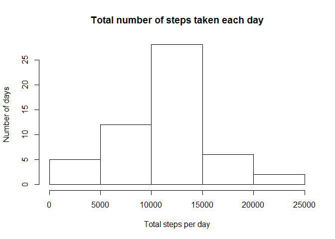
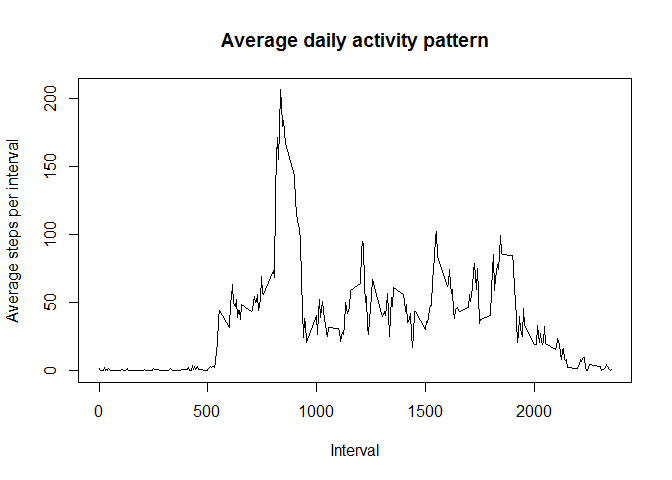

# Reproducible Research: Peer Assessment 1
Nishant Panigrahi  
October 17, 2017  

##Introduction
It is now possible to collect a large amount of data about personal movement using activity monitoring devices such as a [Fitbit](https://www.fitbit.com/in/home), [Nike Fuelband](https://www.nike.com/us/en_us/c/nikeplus-fuelband), or [Jawbone Up](https://jawbone.com/up). These type of devices are part of the "quantified self" movement - a group of enthusiasts who take measurements about themselves regularly to improve their health, to find patterns in their behavior, or because they are tech geeks. But these data remain under-utilized both because the raw data are hard to obtain and there is a lack of statistical methods and software for processing and interpreting the data.

This assignment makes use of data from a personal activity monitoring device. This device collects data at 5 minute intervals through out the day. The data consists of two months of data from an anonymous individual collected during the months of October and November, 2012 and include the number of steps taken in 5 minute intervals each day.

The data for this assignment can be downloaded from the course web site:

* Dataset: [Activity monitoring data](https://d396qusza40orc.cloudfront.net/repdata%2Fdata%2Factivity.zip) [52K]

The variables included in this dataset are:

* **steps**: Number of steps taking in a 5-minute interval (missing values are coded as NA)
* **date**: The date on which the measurement was taken in YYYY-MM-DD format
* **interval**: Identifier for the 5-minute interval in which measurement was taken

The dataset is stored in a comma-separated-value (CSV) file and there are a total of 17,568 observations in this dataset.

##Review Criteria
**Repo**

1. Valid GitHub URL
2. At least one commit beyond the original fork
3. Valid SHA-1
4. SHA-1 corresponds to a specific commit

**Commit containing full submission**

1. Code for reading in the dataset and/or processing the data
2. Histogram of the total number of steps taken each day
3. Mean and median number of steps taken each day
4. Time series plot of the average number of steps taken
5. The 5-minute interval that, on average, contains the maximum number of steps
6. Code to describe and show a strategy for imputing missing data
7. Histogram of the total number of steps taken each day after missing values are imputed
8. Panel plot comparing the average number of steps taken per 5-minute interval across weekdays and weekends
9. All of the R code needed to reproduce the results (numbers, plots, etc.) in the report

##Assignment
This assignment will be described in multiple parts. We will need to write a report that answers the questions detailed below. Ultimately, we will need to complete the entire assignment in a **single R markdown** document that can be processed by **knitr** and be transformed into an HTML file.

Throughout our report we have to make sure we always include the code that we used to generate the output we present. When writing code chunks in the R markdown document, we need to always use ```echo = TRUE``` so that someone else will be able to read the code. **This assignment will be evaluated via peer assessment so it is essential that our peer evaluators be able to review the code for our analysis.**

For the plotting aspects of this assignment, we can feel free to use any plotting system in R (i.e., base, lattice, ggplot2)

Let us first Fork/clone the GitHub repository created for this assignment. We will submit this assignment by pushing our completed files into our forked repository on GitHub. The assignment submission will consist of the URL to our GitHub repository and the SHA-1 commit ID for our repository state.

NOTE: The GitHub repository also contains the dataset for the assignment so we do not have to download the data separately.

###Loading and preprocessing the data
Below is the code that is needed to:

1. Load the data (i.e. ```read.csv()```)

```r
Activity_Montoring_Data<-read.csv("activity.csv")
```
2. Process/transform the data (if necessary) into a format suitable for your analysis

```r
Act_Mon_dat_Step_clean<-Activity_Montoring_Data[!is.na(Activity_Montoring_Data$steps),]
```

###What is mean total number of steps taken per day?
For this part of the assignment, we can ignore the missing values in the dataset.

Below is the code needed and output to:

1. Calculate the total number of steps taken per day

```r
Total_Steps_daywise<-tapply(Act_Mon_dat_Step_clean$steps,Act_Mon_dat_Step_clean$date,FUN = sum)
```

2. Make a histogram of the total number of steps taken each day

```r
hist(Total_Steps_daywise,main = "Total number of steps taken each day",xlab = "Total steps per day",ylab = "Number of days")
```

<!-- -->

3. Calculate and report the mean and median of the total number of steps taken per day

```r
Mean_Tot_Steps_perday<-mean(Total_Steps_daywise, na.rm = TRUE)
Median_Tot_Steps_perday<-median(Total_Steps_daywise, na.rm = TRUE)
```
    The mean and median of the total number of steps taken per day are 10766.19 and 10765 respectively.

###What is the average daily activity pattern?
Below is the code needed and output to:

1. Make a time series plot (i.e. type = "l") of the 5-minute interval (x-axis) and the average number of steps taken, averaged across all days (y-axis)

```r
Avg_Steps_intervalwise<-tapply(Act_Mon_dat_Step_clean$steps, Act_Mon_dat_Step_clean$interval,FUN = mean)
plot(names(Avg_Steps_intervalwise),Avg_Steps_intervalwise,type = 'l',main = "Average daily activity pattern",xlab = "Interval",ylab = "Average steps per interval")
```

<!-- -->

2. Which 5-minute interval, on average across all the days in the dataset, contains the maximum number of steps?

    The 5-minute interval that, on average across all the days in the dataset, contains the maximum number of steps is: 835

###Imputing missing values
Note that there are a number of days/intervals where there are missing values (coded as `NA`). The presence of missing days may introduce bias into some calculations or summaries of the data.

Below is the code needed and output to:

1. Calculate and report the total number of missing values in the dataset (i.e. the total number of rows with NAs)

```r
Tot_Missing_Values<-sum(is.na(Activity_Montoring_Data))
```
    The total number of missing values in the dataset is: 2304

2. Devise a strategy for filling in all of the missing values in the dataset. The strategy does not need to be sophisticated. For example, you could use the mean/median for that day, or the mean for that 5-minute interval, etc.

```r
Act_MonDat_Steps_NAs<-Activity_Montoring_Data[is.na(Activity_Montoring_Data$steps),]
Act_MonDat_Steps_NAs$steps<-Avg_Steps_intervalwise[match(names(Avg_Steps_intervalwise),Act_MonDat_Steps_NAs$interval)]
```

3. Create a new dataset that is equal to the original dataset but with the missing data filled in.

```r
Act_MonDat_NAs_filled<-rbind(Act_Mon_dat_Step_clean,Act_MonDat_Steps_NAs)
Act_MonDat_NAs_filled<-Act_MonDat_NAs_filled[order(Act_MonDat_NAs_filled$date,Act_MonDat_NAs_filled$interval),]
```

4. Make a histogram of the total number of steps taken each day and Calculate and report the mean and median total number of steps taken per day. Do these values differ from the estimates from the first part of the assignment? What is the impact of imputing missing data on the estimates of the total daily number of steps?

```r
Total_Steps_daywise_NAs_filled<-tapply(Act_MonDat_NAs_filled$steps,Act_MonDat_NAs_filled$date,FUN = sum)
hist(Total_Steps_daywise_NAs_filled,main = "Total number of steps taken each day",xlab = "Total steps per day",ylab = "Number of days")
```

<!-- -->

```r
Mean_Tot_Steps_perday_NAs_filled<-mean(Total_Steps_daywise_NAs_filled, na.rm = TRUE)
Median_Tot_Steps_perday_NAs_filled<-median(Total_Steps_daywise_NAs_filled, na.rm = TRUE)
```
    The mean and median of the total number of steps taken per day are 10766.19 and 10766.19 respectively.
    The mean of the total number of steps taken per day remains the same while the median of the same differs.
    The impact of imputing missing data on the estimates of the total daily number of steps is that the mean value for the observations remains the same while the median value of the same increases and becomes equal to the mean.

###Are there differences in activity patterns between weekdays and weekends?
For this part the ```weekdays()``` function may be of some help here. We use the dataset with the filled-in missing values for this part.

Below is the code needed and output to:

1. Create a new factor variable in the dataset with two levels - "weekday" and "weekend" indicating whether a given date is a weekday or weekend day.

```r
Act_MonDat_NAs_filled$date<-as.Date(Act_MonDat_NAs_filled$date)
Act_MonDat_NAs_filled$daytype<-as.factor(ifelse((weekdays(Act_MonDat_NAs_filled$date) %in% c('Monday','Tuesday','Wednesday','Thursday','Friday')),"weekday","weekend"))
```

2. Make a panel plot containing a time series plot (i.e. type = "l") of the 5-minute interval (x-axis) and the average number of steps taken, averaged across all weekday days or weekend days (y-axis). See the README file in the GitHub repository to see an example of what this plot should look like using simulated data.

```r
library(lattice)
Act_MonDat_NAs_filled_AvgstepsIntwise_daytype<-aggregate(x = Act_MonDat_NAs_filled$steps, by = list( Interval = Act_MonDat_NAs_filled$interval, DayType = Act_MonDat_NAs_filled$daytype),FUN = mean)
colnames(Act_MonDat_NAs_filled_AvgstepsIntwise_daytype)[3]<-"Avg.No.Steps"
xyplot(Avg.No.Steps ~ Interval | DayType, data = Act_MonDat_NAs_filled_AvgstepsIntwise_daytype, layout = c(1,2), type = 'l', ylab = "Number of steps")
```

<!-- -->
